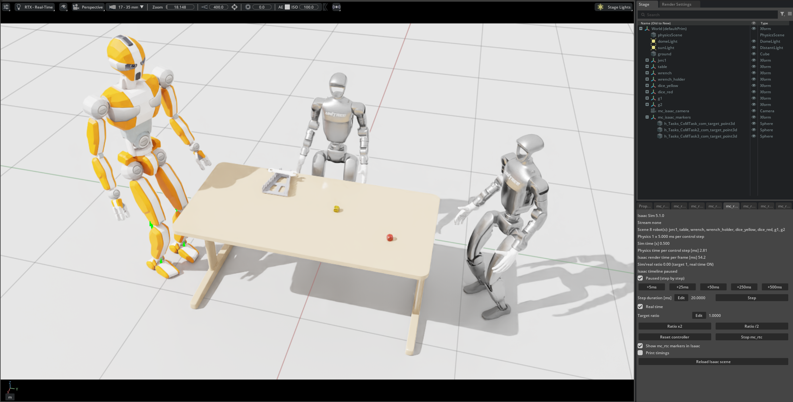
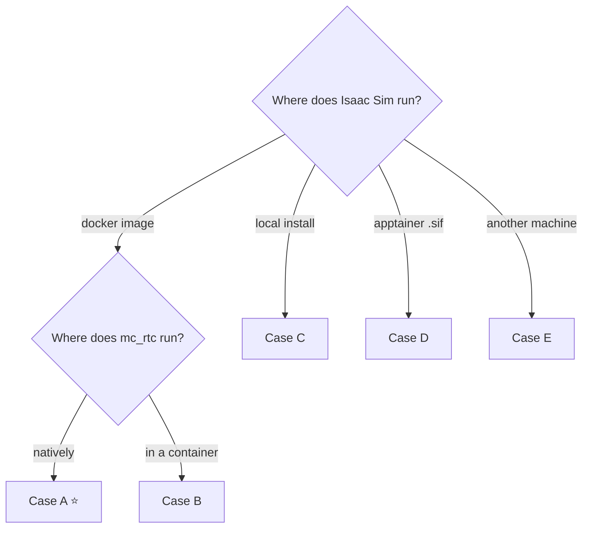
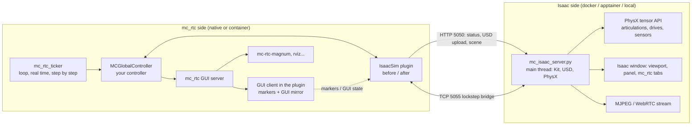
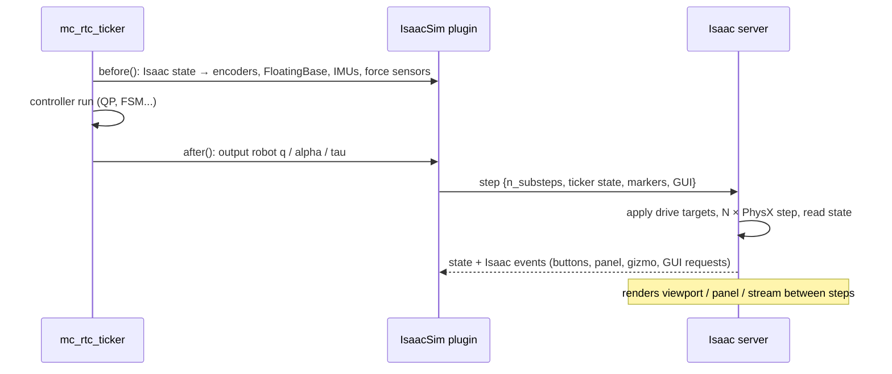

# 🤖 mc_isaac — Run mc_rtc Controllers in NVIDIA Isaac Sim

<p align="center">
  
</p>

[](https://docs.isaacsim.omniverse.nvidia.com/5.1.0/)
[](...)
<!--[](...)
[](...)-->

**mc_isaac** brings the [mc_rtc](https://jrl-umi3218.github.io/mc_rtc/) control framework to [NVIDIA Isaac Sim](https://developer.nvidia.com/isaac/sim), allowing you to write your controller once and run it in a high-fidelity simulation environment with RTX rendering, GPU-accelerated PhysX, and robot assets from Isaac Lab, while keeping the familiar mc_rtc tools and workflow. It provides for Isaac Sim what [mc_mujoco](https://github.com/rohanpsingh/mc_mujoco) provides for MuJoCo: a bridge between mc_rtc and a modern physics simulator.

### ✨ Highlights

| | |
|---|---|
| 🧠 **mc_rtc unchanged** | Any mc_rtc controller (FSM, tasks, observers, plugins, logs) runs as is: `mc_isaac` is `mc_rtc_ticker` + a plugin. |
| 🎮 **Isaac Sim physics & rendering** | PhysX articulations, joint drives, contacts, RTX viewport, USD assets (IsaacLab robots work out of the box). |
| ⚡ **Instant restarts** | Isaac Sim runs as a **persistent server**: the first start takes ~10 s, then each controller run starts in seconds. |
| 📦 **Install anywhere** | Isaac Sim from a **docker image**, an **apptainer** image or a **local install**, found automatically. mc_rtc natively or in its own container. Nothing to share between them: assets are uploaded over TCP. |
| 🖥️ **See it your way** | Isaac window, **headless**, **browser stream**, or remote Isaac UI (WebRTC). The whole **mc_rtc GUI can live inside Isaac** (no need for mc-rtc-magnum). |
| 🔁 **mc_mujoco-like** | Same command line options, same `<robot>_isaac_description` packages pattern, same sensors, step-by-step and real-time controls. |

---

## 📑 Table of contents

1. [🚀 Quick start](#-quick-start)
2. [🧭 Choose your installation](#-choose-your-installation)
   - [A. Isaac Sim in docker + mc_rtc native](#a-isaac-sim-in-docker--mc_rtc-native-recommended)
   - [B. Isaac Sim in docker + mc_rtc in docker](#b-isaac-sim-in-docker--mc_rtc-in-docker)
   - [C. Isaac Sim installed locally](#c-isaac-sim-installed-locally-workstation-install-or-pip)
   - [D. Isaac Sim with apptainer / singularity](#d-isaac-sim-with-apptainer--singularity-clusters)
   - [E. Isaac Sim on another (headless) machine](#e-isaac-sim-on-another-headless-machine)
3. [✅ Features for mc_rtc users](#-features-for-mc_rtc-users)
4. [🖥️ Visualization](#️-visualization)
5. [🎛️ GUI: controlling the simulation](#️-gui-controlling-the-simulation)
6. [🦾 Robots and objects](#-robots-and-objects)
7. [⚙️ Configuration reference](#️-configuration-reference)
8. [🧰 Commands reference](#-commands-reference)
9. [⏱️ Performance](#️-performance)
10. [🩺 Troubleshooting](#-troubleshooting)
11. [🔧 How it works](#-how-it-works)
12. [👩‍💻 Development](#-development)

---

## 🚀 Quick start

Needs: an NVIDIA GPU + driver, [docker](https://docs.docker.com/engine/install/) with the
[NVIDIA Container Toolkit](https://docs.nvidia.com/datacenter/cloud-native/container-toolkit/latest/install-guide.html),
mc_rtc installed (see [installation cases](#-choose-your-installation) for the other setups).

#### 1️⃣ build and install mc_isaac  
```bash
git clone https://github.com/isri-aist/mc_isaac.git && cd mc_isaac          
mkdir build/ && cd build
#Install next to mc_rtc
cmake .. -DCMAKE_BUILD_TYPE=RelWithDebInfo
#Or outside mc-rtc
#cmake .. -DMC_RTC_HONOR_INSTALL_PREFIX=ON -DCMAKE_BUILD_TYPE=RelWithDebInfo -DCMAKE_INSTALL_PREFIX=<INSTALL_PREFIX>
#In that case, add the path "<INSTALL_PREFIX>/mc_isaac/install/lib/mc_plugins" to "GlobalPluginPaths" in your mc_rtc.yaml config
make
make install
```

#### 2️⃣ start Isaac Sim (once, it keeps running)
```bash
docker pull nvcr.io/nvidia/isaac-sim:5.1.0
mc_isaac_server --docker #--detach   # defaults to the official 5.1.0 image (nvcr.io/nvidia/isaac-sim:5.1.0)
```

#### 3️⃣ run a controller: the embedded JVRC1 humanoid with the mc_rtc CoM sample controller
Enable the plugin: create `~/.config/mc_rtc/mc_rtc.yaml` with the following contents, or update your existing file:
```yaml
MainRobot: JVRC1
Enabled: [CoM]
Plugins: [IsaacSim] # IsaacSim is inactive unless started with the mc_isaac command
#GlobalPluginPaths: ["<INSTALL_PREFIX>/mc_isaac/install/lib/mc_plugins"] #Installed outside mc-rtc
```
Run your controller from your terminal
```bash
mc_isaac --gui full
```

🎉 JVRC1 stands in the Isaac window. Move its CoM target from Isaac Sim Scene or any mc_rtc GUI client (mc-rtc-magnum). Stop Isaac with `mc_isaac_server --stop` (You don't need to stop it to change the controller).

<p align="center">
  <a href="examples/JVRC1_CoM.webm">▶️ Watch the JVRC1 CoM demo</a>
</p>

> ⏳ The very first start of a new container compiles Isaac's RTX shaders: several minutes. Next starts: <10 s.

---

## 🧭 Choose your installation

mc_isaac has two sides that only talk through TCP (HTTP `5050` + lockstep bridge `5055`):

- **mc_rtc side** — the `IsaacSim` mc_rtc plugin, the `mc_isaac` command → installed **with mc_rtc**.
- **Isaac side** — one Python file, `mc_isaac_server.py`, run by the Python of Isaac Sim, started by the
  `mc_isaac_server` launcher (standard library only, runs anywhere) → nothing to install in Isaac Sim.

| Case | Isaac Sim | mc_rtc | Who starts Isaac | Status |
|---|---|---|---|---|
| **[A](#a-isaac-sim-in-docker--mc_rtc-native-recommended)** ⭐ | docker image | native | `mc_isaac_server` or automatically by `mc_isaac` | ✅ validated |
| **[B](#b-isaac-sim-in-docker--mc_rtc-in-docker)** | docker image | docker container | `mc_isaac_server` on the host | ✅ validated (author's setup) |
| **[C](#c-isaac-sim-installed-locally-workstation-install-or-pip)** | local install (workstation / pip) | native | `mc_isaac_server --local` or automatically | 🧪 implemented, not validated yet |
| **[D](#d-isaac-sim-with-apptainer--singularity-clusters)** | apptainer `.sif` | native / any | `mc_isaac_server --sif` or automatically | 🧪 implemented, not validated yet |
| **[E](#e-isaac-sim-on-another-headless-machine)** | remote GPU machine | local machine | `mc_isaac_server` on the remote machine | 🧪 possible, not validated yet |



**Recommended Docker image**: `nvcr.io/nvidia/isaac-sim:5.1.0`, the only tested Docker image.
Bare `mc_isaac_server --docker` selects it. Other images and installs remain configurable through Python
discovery and `--container-arg`, but are not validated. Isaac Sim 6.0 is supported by design, not validated yet.

**Common to all cases — install the mc_rtc side**:

```bash
cmake -B build -DCMAKE_INSTALL_PREFIX=<prefix> && cmake --build build --target install
# robot description packages the same way, e.g. g1_isaac_description
```

```yaml
# ~/.config/mc_rtc/mc_rtc.yaml — the plugin does nothing unless mc_rtc is started by mc_isaac
Plugins: [IsaacSim]
GlobalPluginPaths: [<prefix>/lib/mc_plugins]   # only if <prefix> is not the mc_rtc prefix
```

### A. Isaac Sim in docker + mc_rtc native ⭐ (recommended)

**Install**

```bash
# NVIDIA GPU driver + docker + NVIDIA Container Toolkit, then:
docker login nvcr.io        # if required: user $oauthtoken, password = your NGC API key
docker pull nvcr.io/nvidia/isaac-sim:5.1.0
```

**Use** — either start Isaac yourself once:

```bash
mc_isaac_server --docker --detach                                  # official 5.1.0; Isaac window on your desktop
mc_isaac -f my_controller.yaml                                       # as many runs as you want
mc_isaac_server --stop                                               # when you are done
```

or let `mc_isaac` start it when nothing answers (`~/.config/mc_rtc/plugins/IsaacSim.yaml`):

```yaml
server:
  launch:
    mode: docker
    docker: {image: nvcr.io/nvidia/isaac-sim:5.1.0}
    keep_alive: true       # leave Isaac running after the controller exits (next start is instant)
```

The official image uses NVIDIA's Docker setup: `--gpus all`, host networking, EULA/privacy consent,
and user `1234:1234`. Its persistent mounts are:

| Host path | Container path |
|---|---|
| `~/docker/isaac-sim/cache/main` | `/isaac-sim/.cache` |
| `~/docker/isaac-sim/cache/computecache` | `/isaac-sim/.nv/ComputeCache` |
| `~/docker/isaac-sim/logs` | `/isaac-sim/.nvidia-omniverse/logs` |
| `~/docker/isaac-sim/config` | `/isaac-sim/.nvidia-omniverse/config` |
| `~/docker/isaac-sim/data` | `/isaac-sim/.local/share/ov/data` |
| `~/docker/isaac-sim/pkg` | `/isaac-sim/.local/share/ov/pkg` |

Missing directories are created automatically; on hosts with a different UID, new mount directories are
sticky, shared-writable so UID 1234 can use them. Existing permissions are left unchanged: these directories
must be writable by UID/GID 1234. `DISPLAY` and the active session's X11 cookie are forwarded; a private staged
cookie is mounted at `/isaac-sim/.Xauthority`, avoiding assumptions about `~/.Xauthority` (which may not exist
or may be a directory). Cookie discovery checks `XAUTHORITY`, `~/.Xauthority`, and the current user's
GDM, LightDM, SDDM, and Xwayland session locations, even when `XAUTHORITY` or `XDG_RUNTIME_DIR` is unset.
Run from a desktop terminal with `DISPLAY` set. Installing Ubuntu's `xauth` package enables
hostname-independent cookies; without it, the launcher copies the discovered cookie with a warning.
For unusual display-manager layouts, set `XAUTHORITY` to the session's readable cookie file. X11 access
control is never disabled automatically. On machines without a graphical session, unset `DISPLAY` and
use `--headless`; NVIDIA drivers and the NVIDIA Container Toolkit are still required.

Unlike the interactive NVIDIA command, the launcher invokes `python.sh` with the server directly, and retains
the container instead of using `--rm`. The container (`mc_isaac_server` by default) is reused between starts.
Changing its options requires `--recreate`; the official image's host-mounted caches survive recreation.
When migrating from an older launcher, stop the server first, then run:

```bash
mc_isaac_server --docker --recreate --detach
```

Do not add `--host-vulkan` for the recommended setup. Custom images keep the legacy launch profile and can
still opt into host Vulkan mounts and additional Docker arguments.

### B. Isaac Sim in docker + mc_rtc in docker

Both containers use the **host network** (`docker run --network host ...` for the mc_rtc container), so the mc_rtc
side reaches Isaac at `127.0.0.1:5050`. No shared volume is needed.

**Install**

- mc_rtc container: install mc_isaac in it (common steps above).
- Host: `docker pull nvcr.io/nvidia/isaac-sim:5.1.0` and get the mc_isaac sources (no build needed, the launcher is
  a standalone Python script).

**Use**

```bash
# on the host (docker CLI available): start Isaac
mc_isaac/scripts/mc_isaac_server --docker --detach

# in the mc_rtc container
mc_isaac 
```

Keep `server.launch.mode: none` (default) in the mc_rtc container: Isaac is started from the host.

> 📝 Alternative: give the mc_rtc container the docker socket (`-v /var/run/docker.sock:/var/run/docker.sock` + docker
> CLI) and use `launch.mode: docker` as in case A.

### C. Isaac Sim installed locally (workstation install or pip)

**Install**: [Isaac Sim workstation install](https://docs.isaacsim.omniverse.nvidia.com/latest/installation/install_workstation.html)
(folder with `python.sh`) or `pip install isaacsim[...]` (see the Isaac Sim pip installation guide).

**Use**

```bash
mc_isaac_server --local                      # auto-discovery (below)
mc_isaac_server --local ~/isaacsim/python.sh # or explicit
mc_isaac -f my_controller.yaml
```

or `server.launch.mode: local` (`local: {python: auto}`) to let `mc_isaac` start it.

🔎 **Auto-discovery order**: `$ISAACSIM_PYTHON_EXE`, `$ISAACSIM_PATH/python.sh`, `$ISAAC_PATH/python.sh`,
`~/isaacsim/python.sh`, `~/isaac-sim/python.sh`, `/isaac-sim`, `/IsaacSim`, `/isaacsim`, `/opt/isaac-sim`,
`~/.local/share/ov/pkg/isaac-sim-*`, then a Python with the `isaacsim` pip package. Server log:
`~/.cache/mc_isaac/server.log`.

### D. Isaac Sim with apptainer / singularity (clusters)

**Install**

```bash
apptainer pull isaac-sim.sif docker://nvcr.io/nvidia/isaac-sim:5.1.0
```

**Use**

```bash
mc_isaac_server --sif isaac-sim.sif --headless     # --nv is added automatically
mc_isaac -f my_controller.yaml
```

or `server.launch.mode: apptainer` with `apptainer: {image: /path/isaac-sim.sif}`. On a cluster node without a
screen, combine with a [browser stream](#️-visualization).

### E. Isaac Sim on another (headless) machine

Run the server on the GPU machine, the controller elsewhere; assets are uploaded over the network.

```bash
# GPU machine (exposes the API: anyone reaching this address can control the simulation!)
mc_isaac_server --docker nvcr.io/nvidia/isaac-sim:5.1.0 --host 0.0.0.0 --headless --stream mjpeg --detach
# controller machine
mc_isaac -f my_controller.yaml --server <gpu-machine>:5050
# view: http://<gpu-machine>:5050/
```

🔒 Prefer an SSH tunnel to exposing the ports: keep the default `--host 127.0.0.1` and run
`ssh -L 5050:127.0.0.1:5050 -L 5055:127.0.0.1:5055 <gpu-machine>`, then use `--server 127.0.0.1:5050`.
Lockstep stepping adds one network round trip per control step: use a fast link.

---

## ✅ Features for mc_rtc users

| Area | Feature | Status |
|---|---|---|
| 🧠 **Controllers** | Any mc_rtc controller, FSM, observers, mc_rtc plugins (ROS, logging...), `mc_rtc.yaml` options | ✅ |
| | Multiple robots in one controller (robot + objects + environment) | ✅ |
| | Controller switch, reset, log files, `--run-for`, log replay options of `mc_rtc_ticker` | ✅ |
| 🦾 **Robots** | Fixed base and floating base robots | ✅ |
| | Rigid objects (dynamic or fixed/kinematic) and environments (`env/ground`, `env/table`, ...) | ✅ |
| | Robot description packages `<robot>_isaac_description` (USD + yaml), IsaacLab USDs as is | ✅ |
| | Mimic joints (PhysX mimic, e.g. underactuated fingers) | ✅ |
| | Self-collisions, per-robot solver iterations | ✅ |
| 🎯 **Control** | Position control (PhysX PD drives, gains per joint group) + velocity feedforward | ✅ |
| | Torque control (`--torque-control`: mc_rtc torques applied as joint efforts) | ✅ |
| | Command interpolation over physics substeps (`physics_dt` < mc_rtc `Timestep`) | ✅ |
| 📡 **Sensors** | Encoders, joint velocities, joint torques | ✅ |
| | `FloatingBase` (root pose and velocities) | ✅ |
| | Body sensors as IMUs (orientation, gyro, accelerometer) | ✅ |
| | Force/torque sensors | ✅ |
| | Cameras, depth, lidar to mc_rtc | ❌ not yet |
| ⏯️ **Simulation control** | Real time / as fast as possible / target ratio, pause, step by step, +N ms, reset, stop | ✅ |
| | Isaac Play / Pause / Stop buttons synchronized with mc_rtc | ✅ |
| | Persistent server, scene reused when unchanged, asset cache | ✅ |
| 🎨 **mc_rtc GUI** | 3D markers in the Isaac viewport (points, trajectories, polygons, arrows, forces, frames) | ✅ |
| | Drag editable mc_rtc targets with Isaac's transform gizmo | ✅ |
| | Whole 2D mc_rtc GUI inside Isaac (`gui: full`), plots included | ✅ |
| | mc-rtc-magnum / any mc_rtc GUI client still works | ✅ |
| 🖥️ **Visualization** | Isaac window, headless, browser MJPEG stream (fixed camera) | ✅ |
| | WebRTC streaming of the full Isaac UI | 🧪 untested |
| | Collision shapes display | ✅ |
| 🔜 **Not (yet) available** | mc_mujoco Ctrl+drag forces on bodies, sim-only objects declared in the plugin config, parallel environments | ❌ |

---

## 🖥️ Visualization

| Mode | Server command | You see | Typical use |
|---|---|---|---|
| 🪟 **Window** (default) | `mc_isaac_server --docker <image>` | the full Isaac Sim application on your desktop | workstation |
| 🌐 **Browser stream** | `... --headless --stream mjpeg` | view-only video of a fixed camera at `http://<host>:5050/` | remote machine, cluster, light laptop |
| 📡 **WebRTC** 🧪 | `... --stream webrtc` | the full Isaac UI in NVIDIA's *Isaac Sim WebRTC Streaming Client* | remote machine with interaction |
| 🕶️ **Headless** | `... --headless` | nothing from Isaac (use mc-rtc-magnum, mc_rtc_rviz... for the robot state) | fastest |

- Started by `mc_isaac` instead (`launch.mode` ≠ `none`): `mc_isaac --headless`, `--stream mjpeg|webrtc`,
  `--without-visualization` (= headless, no stream), or `server.launch.headless/stream` in the configuration.
- 📷 The **scene camera** (`camera:` in the configuration: position, target, focal length) feeds the browser stream
  and the viewport when headless/WebRTC (`viewport: true` to also use it in the Isaac window).
- 🌐 Stream page `http://<host>:5050/`, raw stream `/stream`, single image `/snapshot.jpg` (`--stream-fps`,
  `--stream-size`). The stream updates while the simulation runs (paused = last frame).
- 🧱 `mc_isaac --with-collisions` shows the PhysX collision shapes.
- ⚠️ The display mode is chosen when the server starts: to switch, `mc_isaac_server --stop` and start it again.

---

## 🎛️ GUI: controlling the simulation

mc_rtc keeps its normal GUI server: **every mc_rtc GUI client still works** (mc-rtc-magnum, mc_rtc_rviz...).
On top of it, mc_isaac adds two things to the mc_rtc GUI and up to three things in the Isaac window:

| Where | What | Always? |
|---|---|---|
| mc_rtc GUI → `Ticker` tab | pause (*Step by step*), +N ms, real time (*Synchronize*), ratio, reset, stop | ✅ |
| mc_rtc GUI → `IsaacSim` tab | server, scene, physics/render times, sim/real ratio, stream address + the same controls as the Isaac panel (pause, +N ms, step X ms, real time, target ratio, x2, /2, reset, stop, markers, timings, reload scene) | ✅ |
| Isaac viewport | mc_rtc 3D markers, draggable targets | ✅ (`markers: true`, `--no-markers` to hide) |
| Isaac window, next to *Property* | 2D GUI, depending on `gui:` (below) | `gui` mode |

### 2D GUI modes (`gui:` in the configuration, or `mc_isaac --gui ...`)

| Mode | Isaac window shows | mc-rtc-magnum needed? |
|---|---|---|
| `none` | nothing (Isaac's own UI only) | yes, if you need mc_rtc GUI |
| `minimal` (default) | the **mc_isaac panel**: server / scene / controller state, pause, steps, real time, ratio, reset, stop, markers, reload / reset / clear scene | for the controller's own GUI |
| `full` | the **whole mc_rtc GUI**: one tab per mc_rtc category docked next to *Property* (sub-categories as tab buttons) + an *mc_rtc plots* window | ❌ no |

**`gui: full` in detail** (behaves like mc-rtc-magnum):

- All 2D elements: labels, array labels, buttons, checkboxes, string / integer / number / array inputs, sliders,
  combo and data combo inputs, tables, **forms** (nested objects, lists, one-of choices) and **schema forms** (e.g.
  *Global → Add task*), **plots** (standard and XY, left/right axes, polygons).
- Values update live. Inputs are read-only until you press **Edit**; **Done** or Enter sends the new value. Forms keep
  what you typed until you press their button.
- Not mirrored: 3D elements (they are the viewport markers), and the 3D gizmos of form point/rotation/transform
  inputs (edit them numerically).
- When the controller exits, the mc_isaac panel comes back (scene reload / reset / clear without controller).


### Markers in the viewport

Points, trajectories, polygons, arrows, forces and frames of the mc_rtc GUI are drawn in the viewport. Editable
points / transforms / rotations get a small sphere: select it, move it with Isaac's transform tools (`W` / `E`), and
the controller receives the new target.

---

## 🦾 Robots and objects

Every robot of the controller (`gc.robots()`: main robot, objects, environments) with an **Isaac description** is
simulated; the main robot must have one, others are skipped with a warning; `exclude_robots` removes visual-only
robots.

📍 **Description lookup** — `<key>.yaml` with key = robot module name, robot name, then `MainRobot` value, in order:
inline `robots:` → `~/.config/mc_rtc/mc_isaac/` → `description_paths` → `<mc_isaac prefix>/share/mc_isaac/` →
`<mc_rtc prefix>/share/mc_isaac/`.

### Description file (`<key>.yaml`)

| Key | Meaning | Default |
|---|---|---|
| `usd` | robot USD, absolute or relative to the yaml | required |
| `extra_files` | files referenced by the USD (relative to its folder: sublayers, textures), uploaded with it | `[]` |
| `fixed` | fixed base (a world joint is added if the USD has none) | `true` unless the mc_rtc robot has a free flyer |
| `rigid` | simulate as a single rigid body | `true` for robots without actuated joints |
| `mass` | mass of a rigid object [kg] | from the USD |
| `self_collisions` | override the articulation self-collision setting | from the USD |
| `solver_iterations` | `{position: N, velocity: M}` PhysX articulation solver iterations | from the USD |
| `drives` | list of `{joints: regex, stiffness, damping, max_effort, max_velocity, armature}` (IsaacLab `ImplicitActuatorCfg` units, rad) | USD gains |
| `builtin: ground_plane` | the mc_rtc `env/ground` module | — |

```yaml
usd: g1/g1.usd
fixed: false
self_collisions: true
drives:
  - {joints: ".*_hip_.*", stiffness: 200.0, damping: 5.0, max_effort: 150.0}
  - {joints: ".*_ankle_.*", stiffness: 40.0, damping: 2.0}
```

Rules to know:

- USD joint and link names must match the mc_rtc URDF. Joints unknown to mc_rtc hold their initial position.
- USD joint drives must be **force** drives (IsaacLab assets are); force sensors need their parent link as a
  separate body (no merged fixed joints).
- Force sensors read like real ones: standing feet give Fz > 0, a free hand reads its own weight (use
  `wrenchWithoutGravity`).

### Available descriptions

| Robot | Where | Notes |
|---|---|---|
| `JVRC1` | embedded in mc_isaac (`robots/jvrc_isaac_description`) | floating humanoid, 4 force sensors, IMU; examples `JVRC1_CoM.yaml`, `JVRC1_Posture.yaml` |
| `env/ground`, `env/table` | embedded in mc_isaac (`descriptions/`) | ground plane, kinematic table |
| Unitree G1 (+ Revo2 hands) | [g1_isaac_description](https://github.com/isri-aist/g1_isaac_description) | floating, self-collisions |
| BrainCo Revo2 hands | [revo2_isaac_description](https://github.com/isri-aist/revo2_isaac_description) | mimic finger joints |

### Making a description for your robot

| You have | Do |
|---|---|
| an IsaacLab / Isaac Sim USD | write the yaml (`usd`, `fixed`, `drives`) — check that joint names match the URDF |
| a URDF | `mc_isaac_urdf_to_usd.py robot.urdf out/robot.usd` in the Isaac image ([below](#mc_isaac_urdf_to_usdpy)), then the yaml |
| meshes of a simple object | `mc_isaac_mesh_to_usd --out obj.usda --visual obj.stl --mass 0.2` ([below](#mc_isaac_mesh_to_usd)), then `usd: obj.usda` |

Package it like `g1_isaac_description` (CMake installs `share/mc_isaac/<module>.yaml` + the USDs) so that it is
found without configuration.

---

## ⚙️ Configuration reference

File: `~/.config/mc_rtc/plugins/IsaacSim.yaml` (defaults: `<prefix>/lib/mc_plugins/etc/IsaacSim.yaml`). All keys are
optional. `mc_isaac` command line options override them for one run.

```yaml
server:
  host: 127.0.0.1
  http_port: 5050
  bridge_port: 5055
  connect_timeout: 120
  launch:
    mode: none
    keep_alive: true
    headless: false
    stream: none
    stream_fps: 15
    stream_size: 1280x720
    docker: {image: "", name: mc_isaac_server, python: auto, host_vulkan: false, container_args: []}
    apptainer: {image: "", python: auto, container_args: []}
    local: {python: auto}
simulation:
  physics_dt: auto
  interpolate_commands: true
  torque_control: false
  print_timings: false
  print_timings_period: 5.0
markers: true
gui: minimal
camera: {position: [2.0, -2.0, 1.5], target: [0.0, 0.0, 0.8], focal_length: 18.0}
description_paths: []
exclude_robots: []
robots: {}
```

| Key | Meaning |
|---|---|
| `server.host`, `http_port`, `bridge_port` | where the Isaac server listens (the bridge port is read from the server when it answers) |
| `server.connect_timeout` | seconds to wait for a ready server |
| `server.launch.mode` | what to do when no server answers: `none` (error, start it yourself), `docker`, `apptainer`, `local`, `auto` (docker if an image is set, else apptainer, else local) |
| `server.launch.keep_alive` | leave the server running when mc_isaac exits |
| `server.launch.headless`, `stream`, `stream_fps`, `stream_size` | display mode of a server started by mc_isaac ([Visualization](#️-visualization)) |
| `server.launch.docker.*` | image, container name, `python.sh` path in the image (`auto` = discovery), host Vulkan ICDs mount, extra `docker create` arguments |
| `server.launch.apptainer.*`, `local.python` | `.sif` image / local `python.sh` (`auto` = discovery) |
| `simulation.physics_dt` | physics step; must divide the mc_rtc `Timestep`. `auto` = largest divisor ≤ 5 ms (IsaacLab default) |
| `simulation.interpolate_commands` | interpolate mc_rtc commands over the physics substeps |
| `simulation.torque_control` | mc_rtc joint torques applied as efforts, drive gains set to 0 |
| `simulation.print_timings`, `print_timings_period` | print a timing breakdown every N seconds |
| `markers` | draw the mc_rtc 3D GUI elements in the viewport |
| `gui` | 2D GUI in the Isaac window: `none`, `minimal`, `full` ([GUI](#️-gui-controlling-the-simulation)) |
| `camera` | scene camera (world frame): `position`, `target`, `focal_length`, `viewport` |
| `description_paths` | extra folders with `<key>.yaml` descriptions |
| `exclude_robots` | mc_rtc robot names not simulated |
| `robots` | inline descriptions, `{<key>: {usd: ..., ...}}` |

♻️ Changing anything that affects the scene (robots, drives, camera, `physics_dt`...) makes the server rebuild it
at the next start; otherwise the scene is only reset (instant restart).

---

## 🧰 Commands reference

### `mc_isaac`

`mc_rtc_ticker` + the IsaacSim plugin, with mc_mujoco-like options. Unknown options go to `mc_rtc_ticker` (log
replay `-l`, `-m`, `-g`...).

| Option | Meaning |
|---|---|
| `-f, --mc-config FILE` | configuration given to mc_rtc |
| `-S, --step-by-step` | start paused |
| `-s, --sync` / `--no-sync` | real time (default) / as fast as possible |
| `-r, --sync-ratio R` | target sim/real time ratio |
| `--run-for SECONDS` | stop after this simulated time |
| `--torque-control` | torque control (drive gains 0) |
| `--server HOST[:PORT]` | Isaac server address (default `127.0.0.1:5050`) |
| `--launch none\|auto\|docker\|apptainer\|local` | start the server if none answers |
| `--headless`, `--stream none\|mjpeg\|webrtc`, `--without-visualization` | display mode of a server started by mc_isaac |
| `--physics-dt DT\|auto` | physics time step |
| `--reload-scene` | rebuild the Isaac scene even if unchanged |
| `--with-collisions` | show collision shapes |
| `--no-markers` | no mc_rtc markers in the viewport |
| `--gui none\|minimal\|full` | 2D GUI in the Isaac window |
| `--print-timings` | timing breakdown every 5 s |

### `mc_isaac_server`

Starts / stops / queries the Isaac server. Standard library only: works on any machine, without mc_rtc.

```bash
mc_isaac_server --docker [IMAGE] | --sif FILE | --local [PYTHON_SH] # start (foreground, Ctrl-C stops it)
mc_isaac_server ... --detach                                        # background, returns when ready
mc_isaac_server --status | --stop | --clear                         # query / stop / empty the scene
```

| Option | Meaning |
|---|---|
| `--docker [IMAGE]` | Docker image; defaults to the recommended, tested `nvcr.io/nvidia/isaac-sim:5.1.0` |
| `--headless`, `--stream none\|mjpeg\|webrtc`, `--stream-fps`, `--stream-size` | display mode |
| `--host`, `--http-port`, `--bridge-port` | addresses (default `127.0.0.1`, `5050`, `5055`) |
| `--name`, `--recreate` | docker container name; recreate after changing options |
| `--host-vulkan` | docker: mount the host Vulkan ICDs (needed by some images/drivers) |
| `--container-arg=ARG` | extra `docker create` / `apptainer exec` argument (repeatable) |
| `--python` | `python.sh` inside the image (skips discovery) |
| `--max-fps`, `--stepping-fps`, `--vsync` | viewport render rate idle / while stepping (60 / 30) |
| `--timeout` | seconds to wait for readiness with `--detach` |
| `--dry-run` | print the commands only |

Docker X11 cookies are refreshed at each start. For the official 5.1.0 profile, the staged cookie is protected by
a private host directory and bind-mounted read-only for UID 1234. Custom images use a cookie copied into the
container, readable by the image's user. `--host-vulkan` replaces the image's Vulkan configuration with the
host's and is only needed by some custom images/drivers. Changing it requires `--recreate`; custom images
without host-mounted caches lose their container-local shader cache.
An HTTP `ready` response alone does not guarantee successful graphics initialization; check the logs for
Vulkan errors if the window is missing.

### `mc_isaac_mesh_to_usd`

STL/OBJ meshes → single-file USDA rigid body (visual + collision meshes, optional mass). Standard library only.

```bash
mc_isaac_mesh_to_usd --out table.usda --visual table.stl --approximation none     # fixed object, exact mesh
mc_isaac_mesh_to_usd --out box.usda --visual box.stl --mass 0.2                   # dynamic, convex hull
mc_isaac_mesh_to_usd --out tool.usda --visual tool.stl --collision c0.stl --collision c1.stl --scale 0.001
```

### `mc_isaac_urdf_to_usd.py`

URDF → single-file USD for mc_isaac, with the Isaac Sim URDF importer and the fixes mc_rtc needs. Installed in
`<prefix>/share/mc_isaac/scripts`, run with the Isaac Python (e.g. in the Isaac image):

```bash
docker run --rm --gpus all -e ACCEPT_EULA=Y --entrypoint /isaac-sim/python.sh -v $PWD:/w nvcr.io/nvidia/isaac-sim:5.1.0 \
  /w/mc_isaac_urdf_to_usd.py /w/robot.urdf /w/out/robot.usd        # package:// URIs replaced by absolute paths
```

| Fix | Why |
|---|---|
| keeps all URDF links and joints | names match mc_rtc; force sensor links stay separate bodies |
| **force** drives | the importer default *acceleration* drives scale gains by inertia: a humanoid cannot stand |
| links without `<inertial>` kept massless | the importer gives them 1 kg each |
| URDF mimic joints → normal driven joints | mc_rtc commands them itself |
| textures copied to `textures/`, relative paths | printed `extra_files` entry to upload them |

---

## ⏱️ Performance

The simulation is **lockstep**: each control step = mc_rtc + physics substeps + data exchange, and the viewport
renders on the same Isaac thread. `--print-timings` shows where the time goes.

| Lever | Effect |
|---|---|
| `physics_dt: auto` (5 ms) instead of 1 ms | up to 5× less physics time |
| `mc_isaac_server --stepping-fps 15` | fewer renders while stepping |
| `--headless` (no stream) | almost no rendering |
| `solver_iterations`, `self_collisions` per robot | some IsaacLab USDs use 32 position iterations |
| `gui: minimal` instead of `full` | less UI work on the Isaac thread for large mc_rtc GUIs |

---

## 🩺 Troubleshooting

| Symptom | Fix |
|---|---|
| `server ... is too old` | restart the server: `mc_isaac_server --stop`, then start it again |
| `Container ... was created with other options` | add `--recreate` |
| No Isaac window | the launcher passes an X11 cookie; otherwise `xhost +SI:localuser:root` on the host |
| Headless server without GPU (`ERROR_INCOMPATIBLE_DRIVER`, `no suitable CUDA GPU`) | hybrid-GPU laptops need X even headless: start from the desktop session (`DISPLAY` is forwarded), add `--host-vulkan` |
| First start / first stream very long | RTX shader compilation, once per container |
| Browser stream frozen | it only updates while the simulation runs |
| `No Isaac description for ... robot X` | add `<key>.yaml` to a description folder, or `exclude_robots: [X]` |
| Robot falls / is soft | drives must be *force* drives, check `drives` gains and `max_effort` (URDF limits are often placeholders) |
| Robot explodes / jitters | `drives` gains, `solver_iterations`, overlapping shapes with `self_collisions` |
| Other screens freeze while the Isaac window is focused | hybrid-GPU (PRIME) laptop: try `sudo prime-select nvidia` and reboot |

---

## 🔧 How it works



One control step (`dt` = mc_rtc `Timestep`):



- 🚀 **Startup**: the plugin waits for the server (or starts it), builds the scene from `gc.robots()` + descriptions,
  uploads the USDs by content hash (cached), and maps Isaac joints to mc_rtc joints by name.
- 🔒 **Single source of truth**: pause/step/reset always go through the mc_rtc `Ticker`; Isaac buttons and panels only
  press its GUI elements.
- 📁 **Sources**: plugin `src/` (`IsaacSimPlugin` config/scene/bridge/GUI tab, `Markers` 3D elements, `GuiMirror` 2D
  GUI, `Net`/`Bridge` TCP and HTTP, `Sha256` asset keys); server `server/mc_isaac_server.py` (protocol documented in
  its header); `scripts/` launcher, command and converters; `descriptions/`, `robots/`, `examples/` embedded data.

---

## 👩‍💻 Development

- 📐 Plugin and server are versioned together: bump `SERVER_VERSION` (server) and `MIN_SERVER_VERSION`
  (`src/IsaacSimPlugin.cpp`) on protocol changes; the plugin refuses older servers.
- 🔁 The server file is copied into the container at every `mc_isaac_server` start: restart the server to test a
  change (no image rebuild).
- 🧪 Smoke test: `mc_isaac -f <prefix>/share/mc_isaac/examples/JVRC1_CoM.yaml --run-for 5` — JVRC1 stands, feet
  `*ForceSensor_fz` ≈ 220 + 365 N in the mc_rtc log.
- 📝 Design notes, Isaac Sim pitfalls, open issues: [`AI.md`](AI.md).

<!-- TODO (license): add a LICENSE file and a License section -->
<!-- TODO (citation / acknowledgments): if any -->
